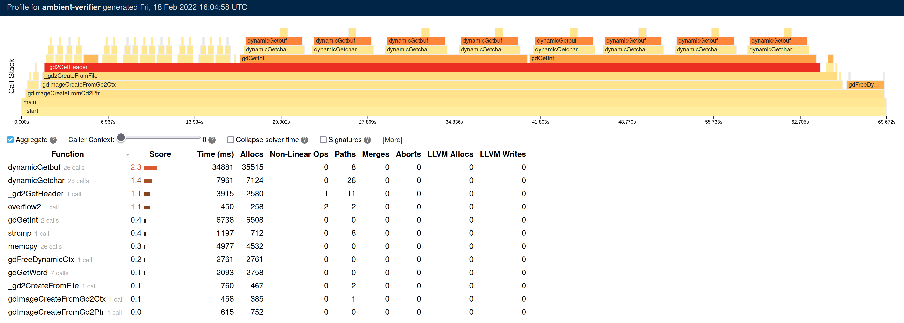

# Profiling

GREASE includes functionality for profiling its performance. To generate a
profiling report, pass `--profile-to <DIR>` to GREASE. This will generate a
`<DIR>/profile.html` file that can be viewed in a web browser. The data that
this HTML file presents will be periodically regenerated as GREASE runs on the
program. A typical example looks like:

The profiling report presents a hierarchical view of the functions that are
invoked during the simulation of a program. The x-axis represents the time, and
the y-axis shows the call stack depth, counting from zero at the bottom. Each
stack frame is given a score based on some simulator heuristics (the time spent
simulating it, its number of allocations, its numbers of merges, etc.).
Generally speaking, the higher the score, the more likely it is to be a
performance bottleneck.

<!-- Copyright (c) Galois, Inc. 2024. -->
