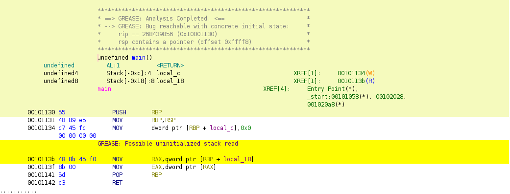

# Ghidra plugin

GREASE includes support for integrating with the
[Ghidra](https://ghidra-sre.org/) software reverse engineering suite via a
plugin. The plugin works interfaces with a local GREASE installation and
presents the results of GREASE's analysis to the user using Ghidra's graphical
user interface.

## Prerequisites

You will need to [download
Ghidra](https://github.com/NationalSecurityAgency/ghidra/releases). You will
also need to build a `grease` binary from source as described in the
[developers' guide](./dev.md).

You may optionally specify the path to your `grease` binary by setting the
`GHIDRA_GREASE_BIN` environment variable. If not set, the Ghidra plugin will
prompt for the path to your `grease` binary.

Similarly, you may optionally specify a directory containing [GREASE override
files](./overrides.md) by setting the `GHIDRA_GREASE_OVERRIDES` environment
variable. If not set, the Ghidra plugin will prompt for a directory.

## Plugin installation

Before starting, make sure you have installed Ghidra and built GREASE from
source, as described in the "Prerequisites" section above. Then perform the
following steps:

1. In Ghidra, use `CodeBrowser Script Manager -> Manage Script Directories` to
   add the `<grease>/ghidra_scripts/` path (where `<grease>` is the path to your
   `grease` checkout).
2. In the Ghidra Script Manager, find `grease.py` and check the `In Tool`
   checkbox to add `GREASE Analysis` to the `Tools` menu.

## Plugin usage

After opening a binary in Ghidra, use `Tools -> GREASE Analysis` to start the
Ghidra plugin. If you haven't defined `GHIDRA_GREASE_BIN` or
`GHIDRA_GREASE_OVERRIDES` environment variables by this point, the plugin will
prompt you with a windows to locate the `grease` binary's location and the
GREASE override directory's locations, respectively.

The plugin will then prompt you to select function(s) to analyze. After picking
the function(s) of interest and clicking `OK`, the plugin will analyze the
function(s) using GREASE and display the results graphically. For example,
the screenshot below demonstrates the results of running the Ghidra plugin on a
`main` function with an uninitialized stack read at address `0x0010113b`:

